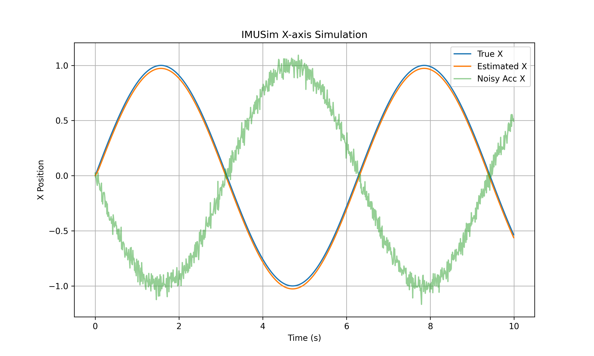
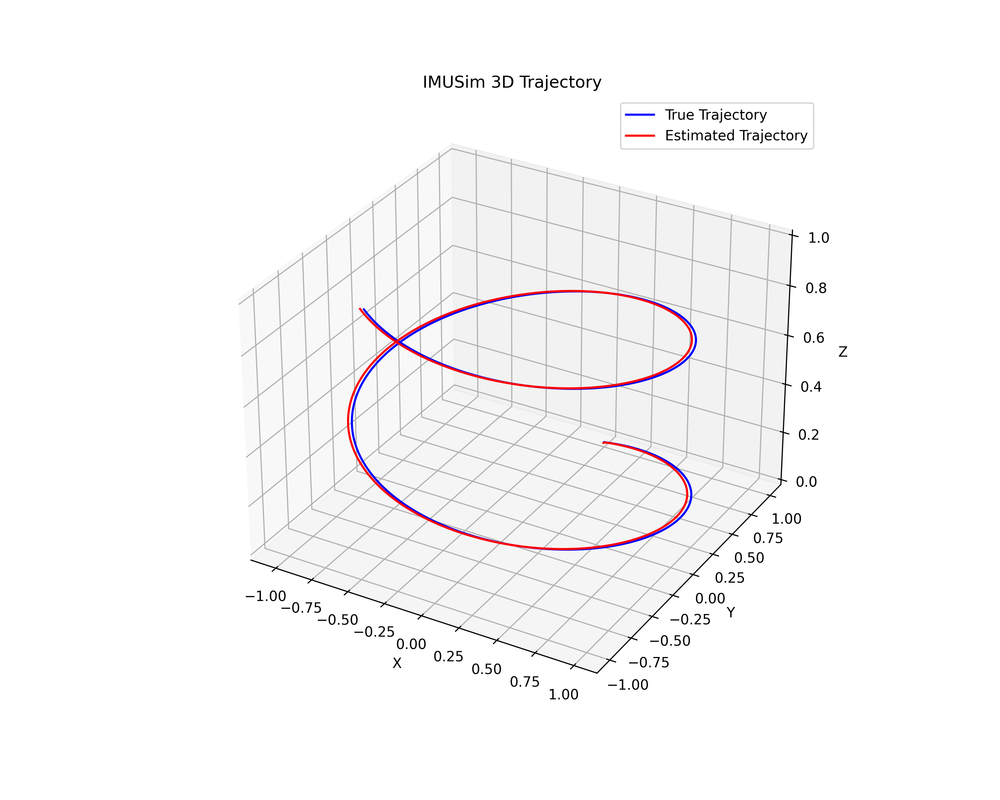

# IMUSim

**IMUSim** is a C++ IMU (Inertial Measurement Unit) sensor fusion simulator that demonstrates how to estimate position using noisy accelerometer and gyroscope data. The project includes a Kalman Filter implementation, Docker support, unit tests, CI/CD integration, and visualization tools.

## Features
- Simulates trajectories and IMU sensor readings (accelerometer + gyroscope)  
- Adds sensor noise and bias  
- Estimates position using a Kalman Filter  
- Logs simulation data to CSV for analysis  
- Unit tested with GoogleTest for output verification 
- Dockerized for reproducible builds and CI/CD pipelines  
- Visualization scripts for plotting trajectories and sensor estimates  

## Project Structure
```
IMUSim/
├─ src/                # C++ source files
├─ include/            # Header files
├─ tests/              # Unit tests
├─ docker/             # Docker-related files
├─ data/               # Simulation CSV output or input files
├─ plots/              # Generated plots / visualization outputs
├─ docs/               # Documentation, project notes
├─ extern/             # External libraries / submodules
├─ venv/               # Python virtual environment for plotting
├─ CMakeLists.txt      # CMake build configuration
├─ Makefile            # Optional Makefile (CMake is used in this project)
├─ README.md           # Project overview and instructions
└─ .gitignore          # Git ignore file
```

## Prerequisites
- C++17 compiler  
- CMake >= 3.10  
- Docker (optional, recommended for CI/CD)  
- Python 3 + matplotlib + pandas (for plotting results)

## Build and Run Locally
```bash
mkdir build && cd build
cmake ..
make
./imusim
```

## Run Unit Tests
```bash
./runTests
# or using ctest
ctest --output-on-failure
```
Unit tests cover Vec3 operations, Trajectory, IMUSensor and KalmanFilter. 

## Docker
Build and run IMUSim in Docker:

```bash
docker build -t imusim .
docker run --rm imusim                  # Run main simulation
docker run --rm imusim ./build/runTests # Run unit tests
```

## CI/CD
IMUSim is configured with GitHub Actions CI:

- Builds Docker image
- Runs main simulation to ensure the program executes
- Runs all unit tests to verify correctness

Any failing tests will automatically fail the CI workflow.

## Visualization
A Python script is provided to visualize the results:

```bash
python plots/plot_simulation.py
```
- Plots are generated in plots module
- Plots true trajectory vs. Kalman Filter estimates
- Shows effect of sensor noise and fusion performance
- 3D visualization of trajectories is also supported

### Example Plots

**X-axis over time:**  
  

**3D Trajectory:**  


